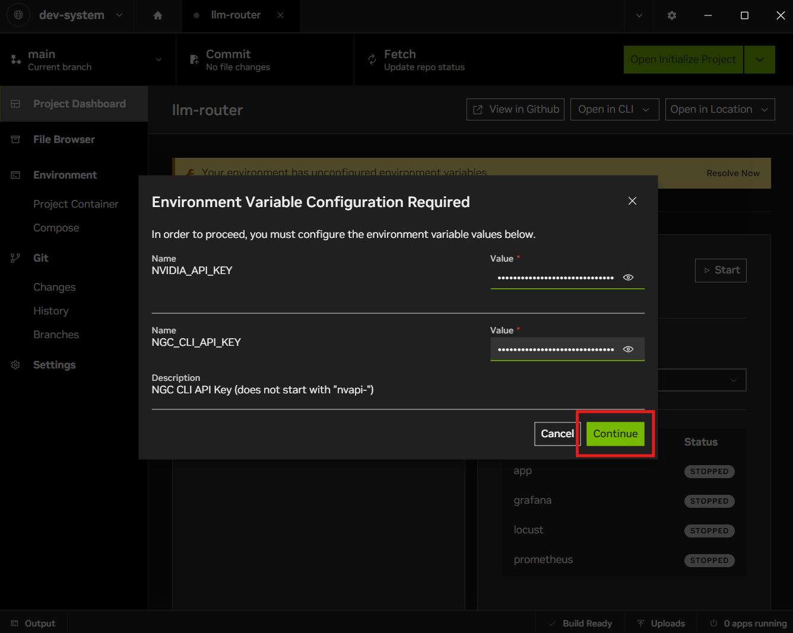
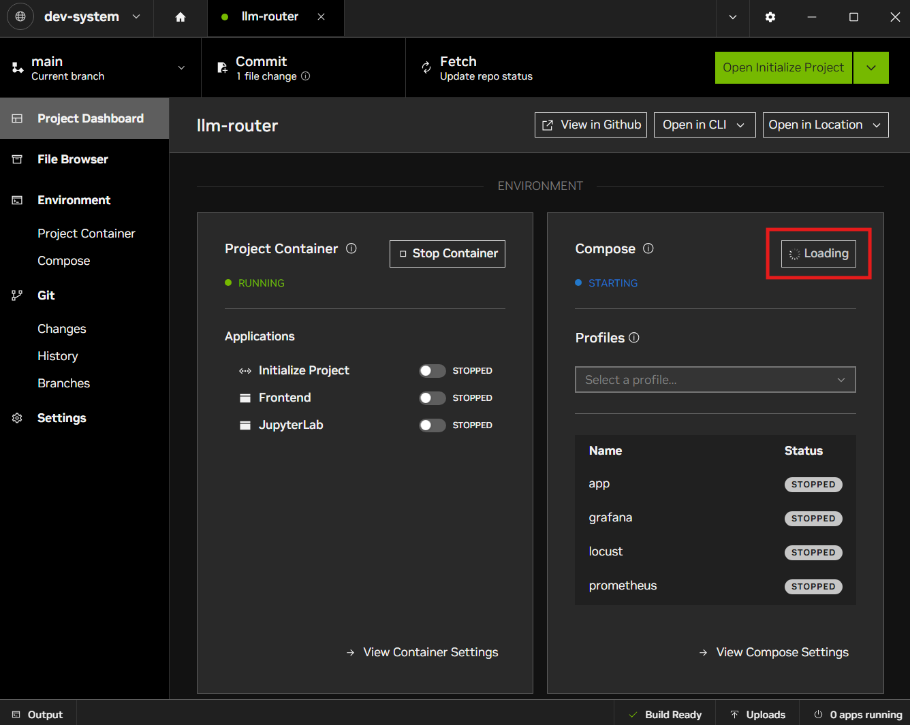
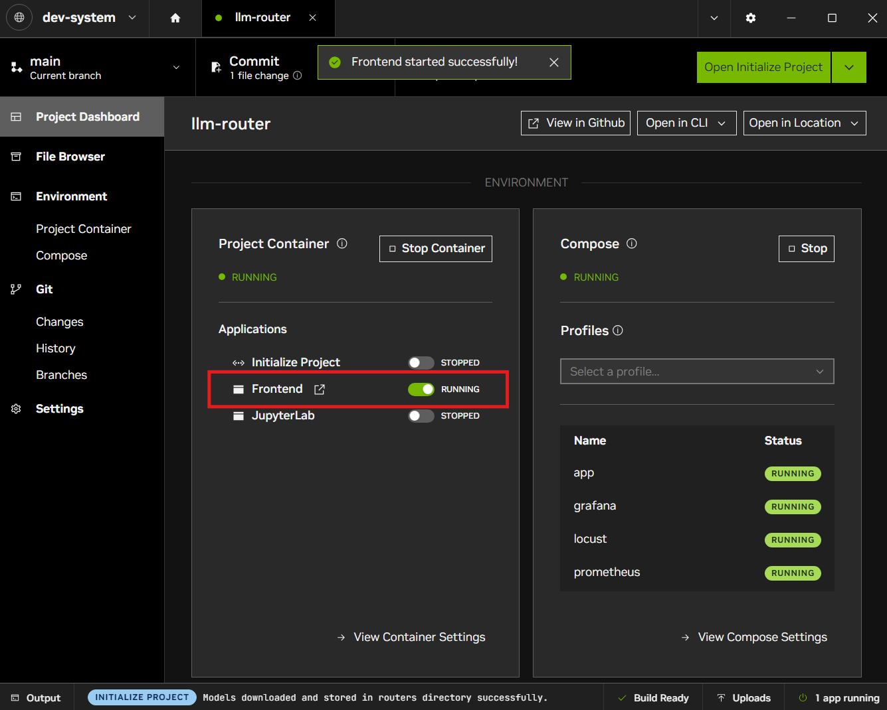
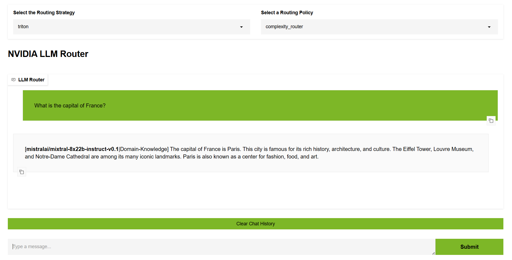

# Quickstart for NVIDIA AI Workbench 

This blueprint is for developers who want a quick start to set up a LLM Router solution with a path-to-production with NVIDIA NIM.

> **Note**
> This app runs in [NVIDIA AI Workbench](https://docs.nvidia.com/ai-workbench/user-guide/latest/overview/introduction.html). It's a free, lightweight developer platform that you can run on your own systems to get up and running with complex AI applications and workloads in a short amount of time. 

> You may want to [**fork**](https://docs.github.com/en/pull-requests/collaborating-with-pull-requests/working-with-forks/fork-a-repo#forking-a-repository) this repository into your own account before proceeding. Otherwise you won't be able to fully push any changes you make because this NVIDIA-owned repository is **read-only**.

*Navigating the README*: [Project Overview](#project-overview) | [Get Started](#get-started) | [License](#license)

*Other Resources*: [:arrow_down: Download AI Workbench](https://www.nvidia.com/en-us/deep-learning-ai/solutions/data-science/workbench/) | [:book: User Guide](https://docs.nvidia.com/ai-workbench/) |[:open_file_folder: Other Projects](https://docs.nvidia.com/ai-workbench/user-guide/latest/quickstart/example-projects.html) | :rotating_light: User Forum (Coming Soon)

## Project Overview

Ever struggled to decide which LLM to use for a specific task? In an ideal world the most accurate LLM would also be the cheapest and fastest, but in practice modern agentic AI systems have to make trade-offs between accuracy, speed, and cost.

This blueprint provides a router that automates these tradeoffs by routing user prompts between different LLMs. Given a user prompt, the router:

- applies a policy (eg task classification or intent classification)
- uses a router trained for that policy to map the prompt to an appropriate LLM
- proxies the prompt to the identified fit-for-purpose LLM

For example, using a task classification policy, the following user prompts can be classified into tasks and directed to the appropriate LLM.

| User Prompt | Task Classification | Route To |
|---|---|---|
| "Help me write a python function to load salesforce data into my warehouse." | Code Generation | deepseek |
| "Tell me about your return policy " | Open QA | llama 70B | 
| "Rewrite the user prompt to be better for an LLM agent. User prompt: what is the best coffee recipe" | Rewrite | llama 8B |

The key features of the LLM Router framework are:

- OpenAI API compliant: use the LLM Router as a drop-in replacement in code regardless of which LLM framework you use.
- Flexible: use the default policy and router, or create your own policy and fine tune a router. We expect additional trained routers to be available from the community as well.
- Configurable: easily configure which backend models are available. 
- Performant: LLM Router uses Rust and NVIDIA Triton Inference Server to add minimal latency compared to routing requests directly to a model.

## Get Started

Ensure you have satisfied the prerequisites for this Blueprint ([details](../README.md#hardware-requirements)). 

### Use Build Endpoints

1. Open NVIDIA AI Workbench. Select a **Location** to work in.

1. **Clone** the project with URL: https://github.com/NVIDIA-AI-Blueprints/llm-router

1. On the **Project Dashboard**, resolve the yellow unconfigured secrets warning by inputting your ``NVIDIA_API_KEY``.

  

  

1. On the Project Dashboard, select **Initialize Project** under project container and wait for the process to complete.

    * This process will download the router model from NGC and move your inputted API Key to the config file for the LLM Router blueprint.

  

1. On the Project Dashboard, select **Start** under the Compose. The compose services may take several minutes to pull and build.

  

1. When the compose services are running and ready, select **Frontend** under the Project Container of the Project Dashboard.

  

1. You can now interact with the LLM Router Chatbot through its browser interface.

  

### Local Hosting

You can customize your LLMs using the default configuration file for the blueprint. If you have a model running, replace the ``api_base`` and ``model`` fields in the configuration files for each ``llm`` you wish to customize and restart the Compose. 

For more details, see the main README [here](../README.md#llms). 

## License

This NVIDIA NVIDIA AI BLUEPRINT is licensed under the [Apache License, Version 2.0.](../LICENSE) This project will download and install additional third-party open source software projects and containers. Review [the license terms of these open source projects](../LICENSE-3rd-party.txt) before use.

The software and materials are governed by the NVIDIA Software License Agreement (found at https://www.nvidia.com/en-us/agreements/enterprise-software/nvidia-software-license-agreement/) and the Product-Specific Terms for NVIDIA AI Products (found at https://www.nvidia.com/en-us/agreements/enterprise-software/product-specific-terms-for-ai-products/), except that models are governed by the AI Foundation Models Community License Agreement (found at NVIDIA Agreements | Enterprise Software | NVIDIA Community Model License) and NVIDIA dataset is governed by the NVIDIA Asset License Agreement found [here](../data/LICENSE.DATA).

For Meta/llama-3.1-70b-instruct model the Llama 3.1 Community License Agreement, for nvidia/llama-3.2-nv-embedqa-1b-v2model the Llama 3.2 Community License Agreement, and for the nvidia/llama-3.2-nv-rerankqa-1b-v2 model the Llama 3.2 Community License Agreement. Built with Llama.
